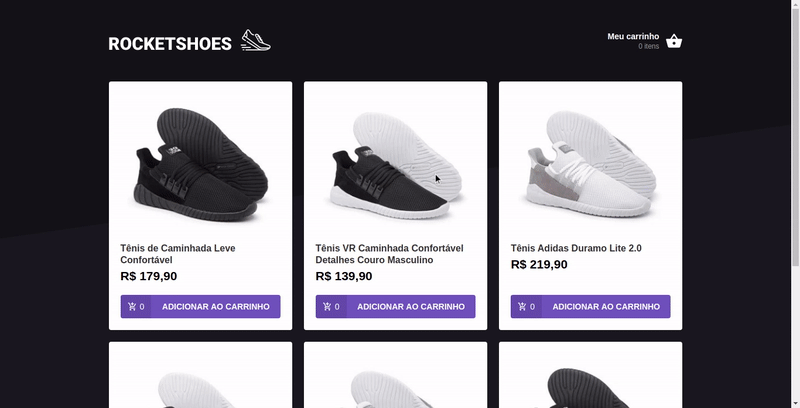

<h1>RocketShoes:</h1>
<p>RocketShoes é uma aplicação criada com o intuito de demonstrar o uso prático da Context Api.</p>
<h2>Funcionalidades extras:</h2>
<ul>
  <li>Mostra subtotal do produto individualmente a medida que o mesmo produto vai sendo adicionado ou removido do carrinho.</li>
  <li>Mostra o preço total geral do carrinho.</li>
  <li>Faz consulta a API para ver se a quantidade do produto está disponível em estoque, caso não tenha mostra notificação.</li>
  <li>Capacidade de remover produto do carrinho.</li>
</ul>
<h2>Principais tecnologias ultilizadas:</h2>
<ul>
  <li>React Js.</li>
  <li>TypeScript.</li>
  <li>Json-Server (Para simular API).</li>
</ul>
<h2>Como executar o projeto:</h2>

```
#Clone o repostiório
$ git clone https://github.com/DausterBarbosa/RocketShoes.git

#Vá para a pasta da aplicação
$ cd RocketShoes

#Instale as dependências
$ yarn

#Inicie a aplicação
$ yarn start
```

<h2>Como executar o Json-Server:</h2>
<p>Json-Server está sendo usado para simular uma API.</p>

```
#Vá para a pasta da aplicação
$ cd RocketShoes

#Inicie o servidor
$ json-server database.json
```
